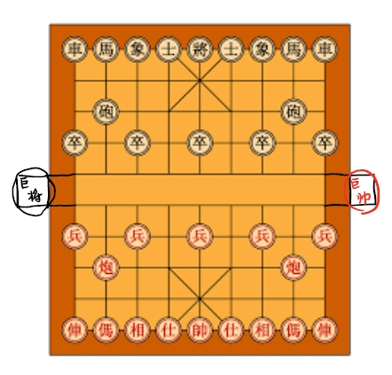
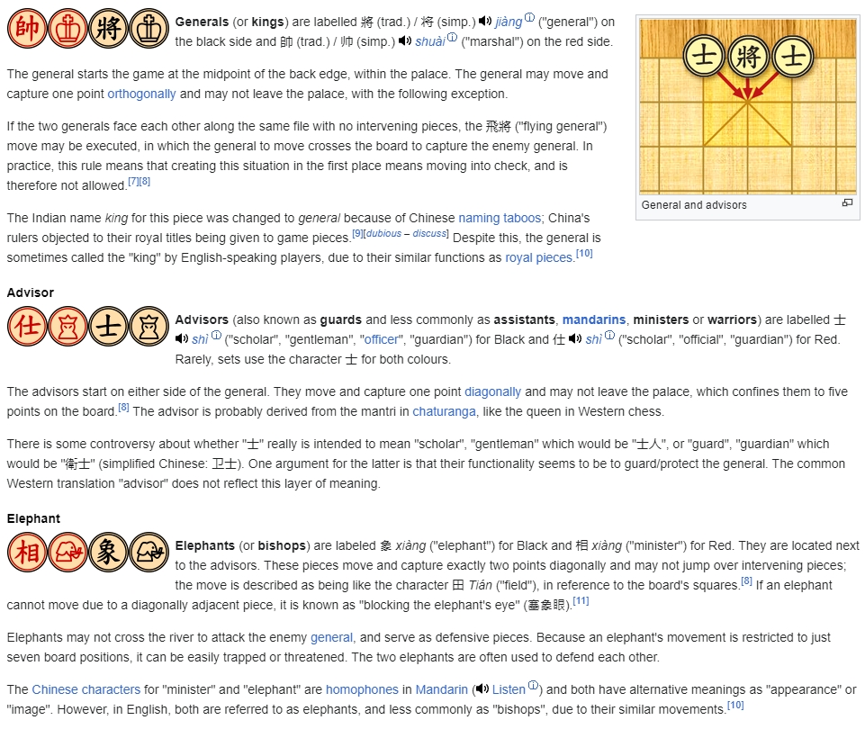
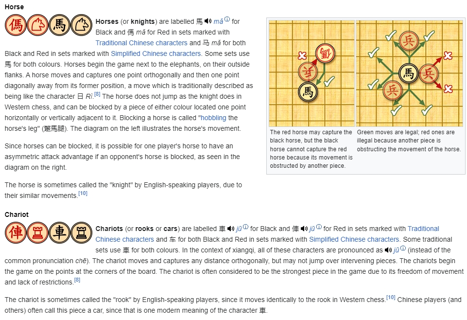
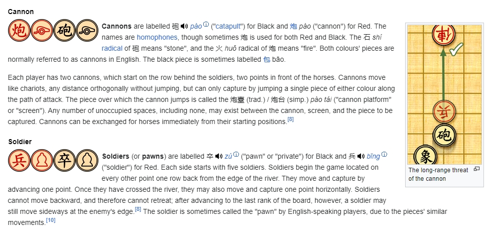
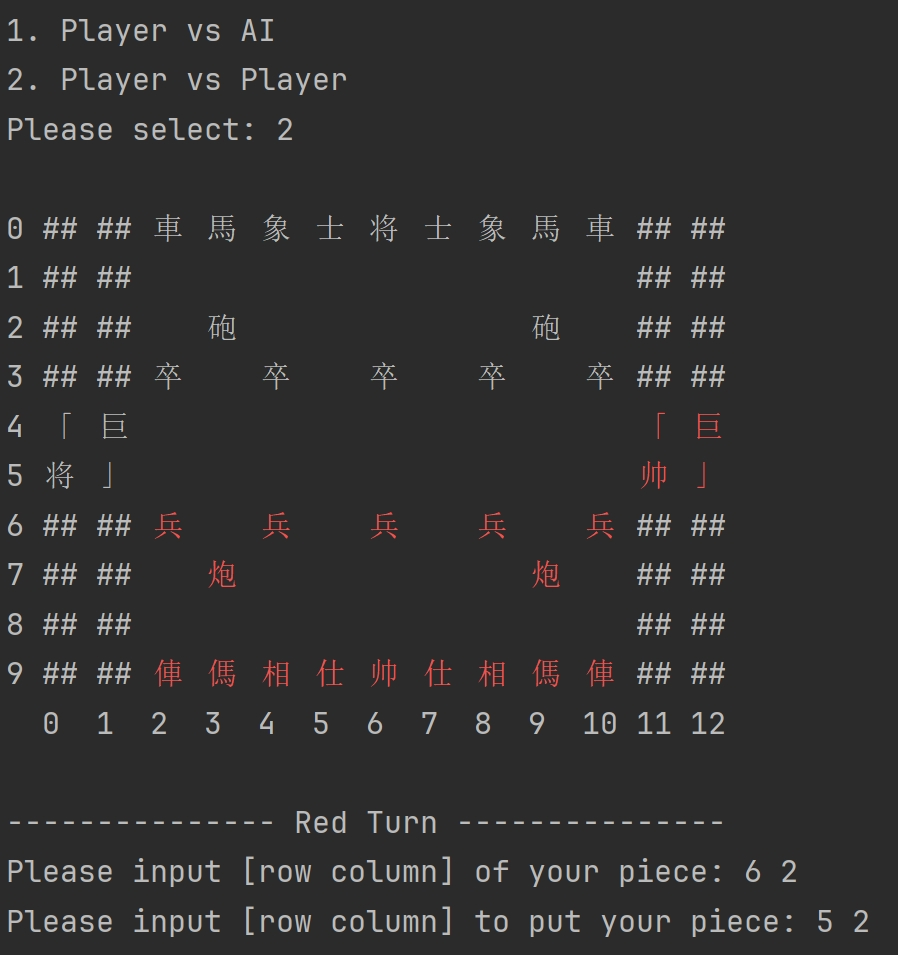

## Super Xiangqi 

Group Member: Jintao Cao, Xicheng Guo

## Game Rules:

Traindiontal rules cite form(https://en.wikipedia.org/wiki/Xiangqi)

Super Piece:
      巨将/巨帅 occupy four points. They move and capture by advancing one point. However, they can eat multiple pieces at one time because they occupy four points. Other pieces can eat them when either of the points of 巨将/巨帅 is occupied.
## Program guide:
Our program can fight both with AI and your friends. Players type into their piece row and column coordinates and their target position.

## Deliverables and other Requirements:

* Have some fun!
* In your own fork, please replace this README.md file's contents with a good introduction to your own project. 
* Targeted Algorithm Analysis:  Regardless of which option you choose, you need to _describe the performance characteristics of some critical parts of your program and explain why you chose the data structures and core algorithm(s) you did_. Examples, if you chose Type #1, what's the Big-O, Big-Theta, or Big-Omega run-time complexity of your puzzle solver? Or the puzzle generator? If you're doing Type #2 and using minimax or negamax, what's the complexity of your _heuristic evaluation function_? ...and of the function that finds all legal moves from a game state? 
* Performance Measurement: Supplement the analysis above with run-time measurements of multiple iterations of the game or puzzles as discussed in class. Sample results from a run-time profiler is a good idea at least as part of the measurements.
* If your team has more than one student, see that everyone makes substantial git commits. In addition, your README documentation should include a summary of how you shared the work.
* Live in-class presentation & demonstration of your work.
